## IMPORT LIBRARIES


```python
import pandas as pd
import matplotlib.pyplot as plt
%matplotlib inline
import seaborn as sns

from sklearn.model_selection import train_test_split
from sklearn.ensemble import RandomForestClassifier
from sklearn.tree import DecisionTreeClassifier

from sklearn import metrics
from sklearn.metrics import confusion_matrix, accuracy_score 
from sklearn.preprocessing import StandardScaler, LabelEncoder
```

## GETTING ABOUT THE DATASET


```python
df = pd.read_csv('mushrooms.csv')
```


```python
df.head()
```


<div>
<style scoped>
    .dataframe tbody tr th:only-of-type {
        vertical-align: middle;
    }

    .dataframe tbody tr th {
        vertical-align: top;
    }

    .dataframe thead th {
        text-align: right;
    }
</style>
<table border="1" class="dataframe">
  <thead>
    <tr style="text-align: right;">
      <th></th>
      <th>class</th>
      <th>cap-shape</th>
      <th>cap-surface</th>
      <th>cap-color</th>
      <th>bruises</th>
      <th>odor</th>
      <th>gill-attachment</th>
      <th>gill-spacing</th>
      <th>gill-size</th>
      <th>gill-color</th>
      <th>...</th>
      <th>stalk-surface-below-ring</th>
      <th>stalk-color-above-ring</th>
      <th>stalk-color-below-ring</th>
      <th>veil-type</th>
      <th>veil-color</th>
      <th>ring-number</th>
      <th>ring-type</th>
      <th>spore-print-color</th>
      <th>population</th>
      <th>habitat</th>
    </tr>
  </thead>
  <tbody>
    <tr>
      <th>0</th>
      <td>p</td>
      <td>x</td>
      <td>s</td>
      <td>n</td>
      <td>t</td>
      <td>p</td>
      <td>f</td>
      <td>c</td>
      <td>n</td>
      <td>k</td>
      <td>...</td>
      <td>s</td>
      <td>w</td>
      <td>w</td>
      <td>p</td>
      <td>w</td>
      <td>o</td>
      <td>p</td>
      <td>k</td>
      <td>s</td>
      <td>u</td>
    </tr>
    <tr>
      <th>1</th>
      <td>e</td>
      <td>x</td>
      <td>s</td>
      <td>y</td>
      <td>t</td>
      <td>a</td>
      <td>f</td>
      <td>c</td>
      <td>b</td>
      <td>k</td>
      <td>...</td>
      <td>s</td>
      <td>w</td>
      <td>w</td>
      <td>p</td>
      <td>w</td>
      <td>o</td>
      <td>p</td>
      <td>n</td>
      <td>n</td>
      <td>g</td>
    </tr>
    <tr>
      <th>2</th>
      <td>e</td>
      <td>b</td>
      <td>s</td>
      <td>w</td>
      <td>t</td>
      <td>l</td>
      <td>f</td>
      <td>c</td>
      <td>b</td>
      <td>n</td>
      <td>...</td>
      <td>s</td>
      <td>w</td>
      <td>w</td>
      <td>p</td>
      <td>w</td>
      <td>o</td>
      <td>p</td>
      <td>n</td>
      <td>n</td>
      <td>m</td>
    </tr>
    <tr>
      <th>3</th>
      <td>p</td>
      <td>x</td>
      <td>y</td>
      <td>w</td>
      <td>t</td>
      <td>p</td>
      <td>f</td>
      <td>c</td>
      <td>n</td>
      <td>n</td>
      <td>...</td>
      <td>s</td>
      <td>w</td>
      <td>w</td>
      <td>p</td>
      <td>w</td>
      <td>o</td>
      <td>p</td>
      <td>k</td>
      <td>s</td>
      <td>u</td>
    </tr>
    <tr>
      <th>4</th>
      <td>e</td>
      <td>x</td>
      <td>s</td>
      <td>g</td>
      <td>f</td>
      <td>n</td>
      <td>f</td>
      <td>w</td>
      <td>b</td>
      <td>k</td>
      <td>...</td>
      <td>s</td>
      <td>w</td>
      <td>w</td>
      <td>p</td>
      <td>w</td>
      <td>o</td>
      <td>e</td>
      <td>n</td>
      <td>a</td>
      <td>g</td>
    </tr>
  </tbody>
</table>
<p>5 rows × 23 columns</p>
</div>


```python
df.tail()
```


<div>
<style scoped>
    .dataframe tbody tr th:only-of-type {
        vertical-align: middle;
    }

    .dataframe tbody tr th {
        vertical-align: top;
    }

    .dataframe thead th {
        text-align: right;
    }
</style>
<table border="1" class="dataframe">
  <thead>
    <tr style="text-align: right;">
      <th></th>
      <th>class</th>
      <th>cap-shape</th>
      <th>cap-surface</th>
      <th>cap-color</th>
      <th>bruises</th>
      <th>odor</th>
      <th>gill-attachment</th>
      <th>gill-spacing</th>
      <th>gill-size</th>
      <th>gill-color</th>
      <th>...</th>
      <th>stalk-surface-below-ring</th>
      <th>stalk-color-above-ring</th>
      <th>stalk-color-below-ring</th>
      <th>veil-type</th>
      <th>veil-color</th>
      <th>ring-number</th>
      <th>ring-type</th>
      <th>spore-print-color</th>
      <th>population</th>
      <th>habitat</th>
    </tr>
  </thead>
  <tbody>
    <tr>
      <th>8119</th>
      <td>e</td>
      <td>k</td>
      <td>s</td>
      <td>n</td>
      <td>f</td>
      <td>n</td>
      <td>a</td>
      <td>c</td>
      <td>b</td>
      <td>y</td>
      <td>...</td>
      <td>s</td>
      <td>o</td>
      <td>o</td>
      <td>p</td>
      <td>o</td>
      <td>o</td>
      <td>p</td>
      <td>b</td>
      <td>c</td>
      <td>l</td>
    </tr>
    <tr>
      <th>8120</th>
      <td>e</td>
      <td>x</td>
      <td>s</td>
      <td>n</td>
      <td>f</td>
      <td>n</td>
      <td>a</td>
      <td>c</td>
      <td>b</td>
      <td>y</td>
      <td>...</td>
      <td>s</td>
      <td>o</td>
      <td>o</td>
      <td>p</td>
      <td>n</td>
      <td>o</td>
      <td>p</td>
      <td>b</td>
      <td>v</td>
      <td>l</td>
    </tr>
    <tr>
      <th>8121</th>
      <td>e</td>
      <td>f</td>
      <td>s</td>
      <td>n</td>
      <td>f</td>
      <td>n</td>
      <td>a</td>
      <td>c</td>
      <td>b</td>
      <td>n</td>
      <td>...</td>
      <td>s</td>
      <td>o</td>
      <td>o</td>
      <td>p</td>
      <td>o</td>
      <td>o</td>
      <td>p</td>
      <td>b</td>
      <td>c</td>
      <td>l</td>
    </tr>
    <tr>
      <th>8122</th>
      <td>p</td>
      <td>k</td>
      <td>y</td>
      <td>n</td>
      <td>f</td>
      <td>y</td>
      <td>f</td>
      <td>c</td>
      <td>n</td>
      <td>b</td>
      <td>...</td>
      <td>k</td>
      <td>w</td>
      <td>w</td>
      <td>p</td>
      <td>w</td>
      <td>o</td>
      <td>e</td>
      <td>w</td>
      <td>v</td>
      <td>l</td>
    </tr>
    <tr>
      <th>8123</th>
      <td>e</td>
      <td>x</td>
      <td>s</td>
      <td>n</td>
      <td>f</td>
      <td>n</td>
      <td>a</td>
      <td>c</td>
      <td>b</td>
      <td>y</td>
      <td>...</td>
      <td>s</td>
      <td>o</td>
      <td>o</td>
      <td>p</td>
      <td>o</td>
      <td>o</td>
      <td>p</td>
      <td>o</td>
      <td>c</td>
      <td>l</td>
    </tr>
  </tbody>
</table>
<p>5 rows × 23 columns</p>
</div>


## Attribute Information: (classes: edible=e, poisonous=p)

>cap-shape: bell=b,conical=c,convex=x,flat=f, knobbed=k,sunken=s

>cap-surface: fibrous=f,grooves=g,scaly=y,smooth=s

>cap-color: brown=n,buff=b,cinnamon=c,gray=g,green=r,pink=p,purple=u,red=e,white=w,yellow=y

>bruises: bruises=t,no=f

>odor: almond=a,anise=l,creosote=c,fishy=y,foul=f,musty=m,none=n,pungent=p,spicy=s

>gill-attachment: attached=a,descending=d,free=f,notched=n

>gill-spacing: close=c,crowded=w,distant=d

>gill-size: broad=b,narrow=n

>gill-color: black=k,brown=n,buff=b,chocolate=h,gray=g, green=r,orange=o,pink=p,purple=u,red=e,white=w,yellow=y

>stalk-shape: enlarging=e,tapering=t

>stalk-root: bulbous=b,club=c,cup=u,equal=e,rhizomorphs=z,rooted=r,missing=?

>stalk-surface-above-ring: fibrous=f,scaly=y,silky=k,smooth=s

>stalk-surface-below-ring: fibrous=f,scaly=y,silky=k,smooth=s

>stalk-color-above-ring: brown=n,buff=b,cinnamon=c,gray=g,orange=o,pink=p,red=e,white=w,yellow=y

>stalk-color-below-ring: brown=n,buff=b,cinnamon=c,gray=g,orange=o,pink=p,red=e,white=w,yellow=y

>veil-type: partial=p,universal=u

>veil-color: brown=n,orange=o,white=w,yellow=y

>ring-number: none=n,one=o,two=t

>ring-type: cobwebby=c,evanescent=e,flaring=f,large=l,none=n,pendant=p,sheathing=s,zone=z

>spore-print-color: black=k,brown=n,buff=b,chocolate=h,green=r,orange=o,purple=u,white=w,yellow=y

>population: abundant=a,clustered=c,numerous=n,scattered=s,several=v,solitary=y

>habitat: grasses=g,leaves=l,meadows=m,paths=p,urban=u,waste=w,woods=d


```python
df.shape
```


    (8124, 23)


```python
df.isnull().sum()
```


    class                       0
    cap-shape                   0
    cap-surface                 0
    cap-color                   0
    bruises                     0
    odor                        0
    gill-attachment             0
    gill-spacing                0
    gill-size                   0
    gill-color                  0
    stalk-shape                 0
    stalk-root                  0
    stalk-surface-above-ring    0
    stalk-surface-below-ring    0
    stalk-color-above-ring      0
    stalk-color-below-ring      0
    veil-type                   0
    veil-color                  0
    ring-number                 0
    ring-type                   0
    spore-print-color           0
    population                  0
    habitat                     0
    dtype: int64


```python
df.info()
```

    <class 'pandas.core.frame.DataFrame'>
    RangeIndex: 8124 entries, 0 to 8123
    Data columns (total 23 columns):
     #   Column                    Non-Null Count  Dtype 
    ---  ------                    --------------  ----- 
     0   class                     8124 non-null   object
     1   cap-shape                 8124 non-null   object
     2   cap-surface               8124 non-null   object
     3   cap-color                 8124 non-null   object
     4   bruises                   8124 non-null   object
     5   odor                      8124 non-null   object
     6   gill-attachment           8124 non-null   object
     7   gill-spacing              8124 non-null   object
     8   gill-size                 8124 non-null   object
     9   gill-color                8124 non-null   object
     10  stalk-shape               8124 non-null   object
     11  stalk-root                8124 non-null   object
     12  stalk-surface-above-ring  8124 non-null   object
     13  stalk-surface-below-ring  8124 non-null   object
     14  stalk-color-above-ring    8124 non-null   object
     15  stalk-color-below-ring    8124 non-null   object
     16  veil-type                 8124 non-null   object
     17  veil-color                8124 non-null   object
     18  ring-number               8124 non-null   object
     19  ring-type                 8124 non-null   object
     20  spore-print-color         8124 non-null   object
     21  population                8124 non-null   object
     22  habitat                   8124 non-null   object
    dtypes: object(23)
    memory usage: 1.4+ MB
    


```python
df['class'].value_counts()
```


    e    4208
    p    3916
    Name: class, dtype: int64


## DATA VISUALIZATION


```python
def graph(column):
    plt.figure(figsize=(8,6.5))
    sns.countplot(df[column],palette='viridis')
    plt.xticks(rotation='vertical',size=15)
    plt.show()
    
for i in df.columns:
    graph(str(i))
    
```

    c:\users\sadaruwan\appdata\local\programs\python\python39\lib\site-packages\seaborn\_decorators.py:36: FutureWarning: Pass the following variable as a keyword arg: x. From version 0.12, the only valid positional argument will be `data`, and passing other arguments without an explicit keyword will result in an error or misinterpretation.
      warnings.warn(
    


    
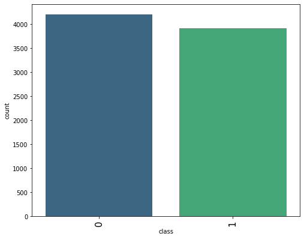
    


    c:\users\sadaruwan\appdata\local\programs\python\python39\lib\site-packages\seaborn\_decorators.py:36: FutureWarning: Pass the following variable as a keyword arg: x. From version 0.12, the only valid positional argument will be `data`, and passing other arguments without an explicit keyword will result in an error or misinterpretation.
      warnings.warn(
    


    
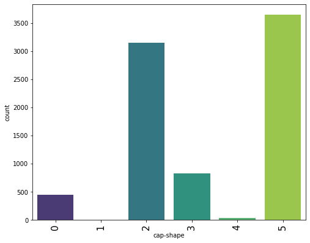
    


    c:\users\sadaruwan\appdata\local\programs\python\python39\lib\site-packages\seaborn\_decorators.py:36: FutureWarning: Pass the following variable as a keyword arg: x. From version 0.12, the only valid positional argument will be `data`, and passing other arguments without an explicit keyword will result in an error or misinterpretation.
      warnings.warn(
    


    
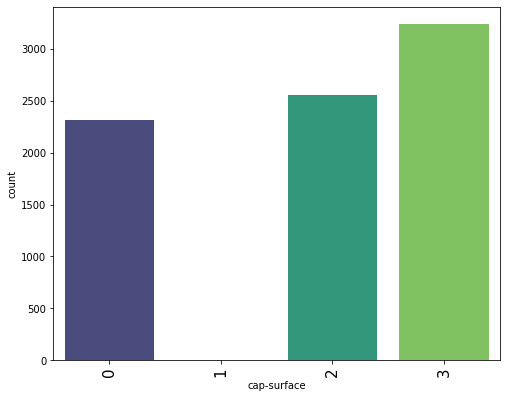
    


    c:\users\sadaruwan\appdata\local\programs\python\python39\lib\site-packages\seaborn\_decorators.py:36: FutureWarning: Pass the following variable as a keyword arg: x. From version 0.12, the only valid positional argument will be `data`, and passing other arguments without an explicit keyword will result in an error or misinterpretation.
      warnings.warn(
    


    
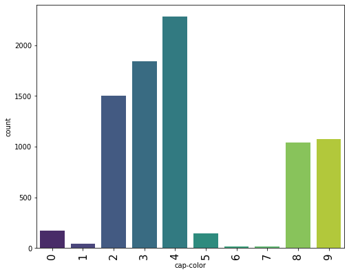
    


    c:\users\sadaruwan\appdata\local\programs\python\python39\lib\site-packages\seaborn\_decorators.py:36: FutureWarning: Pass the following variable as a keyword arg: x. From version 0.12, the only valid positional argument will be `data`, and passing other arguments without an explicit keyword will result in an error or misinterpretation.
      warnings.warn(
    


    
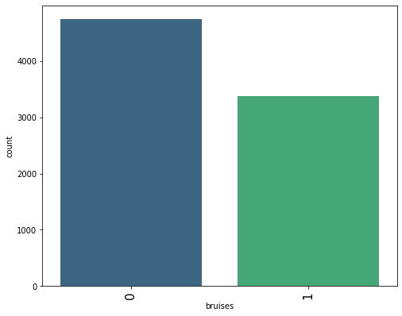
    


    c:\users\sadaruwan\appdata\local\programs\python\python39\lib\site-packages\seaborn\_decorators.py:36: FutureWarning: Pass the following variable as a keyword arg: x. From version 0.12, the only valid positional argument will be `data`, and passing other arguments without an explicit keyword will result in an error or misinterpretation.
      warnings.warn(
    


    
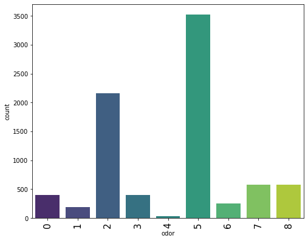
    


    c:\users\sadaruwan\appdata\local\programs\python\python39\lib\site-packages\seaborn\_decorators.py:36: FutureWarning: Pass the following variable as a keyword arg: x. From version 0.12, the only valid positional argument will be `data`, and passing other arguments without an explicit keyword will result in an error or misinterpretation.
      warnings.warn(
    


    
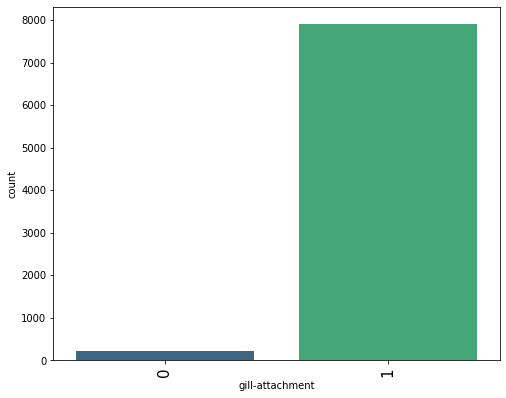
    


    c:\users\sadaruwan\appdata\local\programs\python\python39\lib\site-packages\seaborn\_decorators.py:36: FutureWarning: Pass the following variable as a keyword arg: x. From version 0.12, the only valid positional argument will be `data`, and passing other arguments without an explicit keyword will result in an error or misinterpretation.
      warnings.warn(
    


    
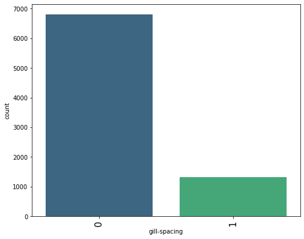
    


    c:\users\sadaruwan\appdata\local\programs\python\python39\lib\site-packages\seaborn\_decorators.py:36: FutureWarning: Pass the following variable as a keyword arg: x. From version 0.12, the only valid positional argument will be `data`, and passing other arguments without an explicit keyword will result in an error or misinterpretation.
      warnings.warn(
    


    
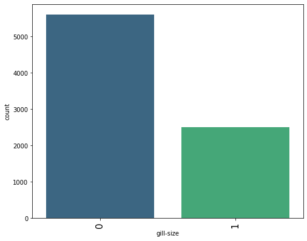
    


    c:\users\sadaruwan\appdata\local\programs\python\python39\lib\site-packages\seaborn\_decorators.py:36: FutureWarning: Pass the following variable as a keyword arg: x. From version 0.12, the only valid positional argument will be `data`, and passing other arguments without an explicit keyword will result in an error or misinterpretation.
      warnings.warn(
    


    
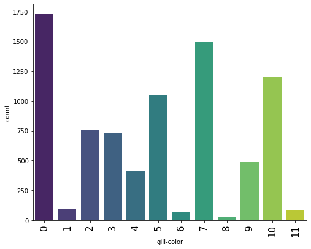
    


    c:\users\sadaruwan\appdata\local\programs\python\python39\lib\site-packages\seaborn\_decorators.py:36: FutureWarning: Pass the following variable as a keyword arg: x. From version 0.12, the only valid positional argument will be `data`, and passing other arguments without an explicit keyword will result in an error or misinterpretation.
      warnings.warn(
    


    
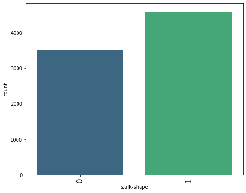
    


    c:\users\sadaruwan\appdata\local\programs\python\python39\lib\site-packages\seaborn\_decorators.py:36: FutureWarning: Pass the following variable as a keyword arg: x. From version 0.12, the only valid positional argument will be `data`, and passing other arguments without an explicit keyword will result in an error or misinterpretation.
      warnings.warn(
    


    
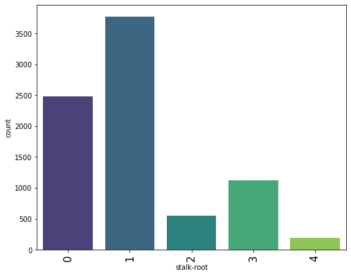
    


    c:\users\sadaruwan\appdata\local\programs\python\python39\lib\site-packages\seaborn\_decorators.py:36: FutureWarning: Pass the following variable as a keyword arg: x. From version 0.12, the only valid positional argument will be `data`, and passing other arguments without an explicit keyword will result in an error or misinterpretation.
      warnings.warn(
    


    
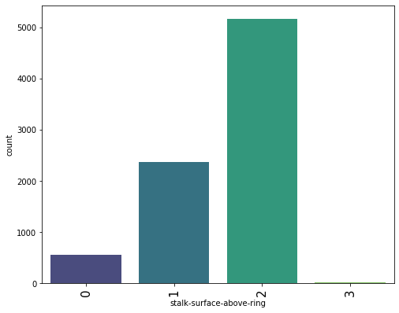
    


    c:\users\sadaruwan\appdata\local\programs\python\python39\lib\site-packages\seaborn\_decorators.py:36: FutureWarning: Pass the following variable as a keyword arg: x. From version 0.12, the only valid positional argument will be `data`, and passing other arguments without an explicit keyword will result in an error or misinterpretation.
      warnings.warn(
    


    
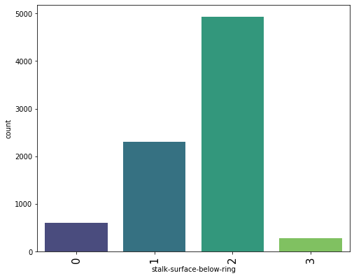
    


    c:\users\sadaruwan\appdata\local\programs\python\python39\lib\site-packages\seaborn\_decorators.py:36: FutureWarning: Pass the following variable as a keyword arg: x. From version 0.12, the only valid positional argument will be `data`, and passing other arguments without an explicit keyword will result in an error or misinterpretation.
      warnings.warn(
    


    
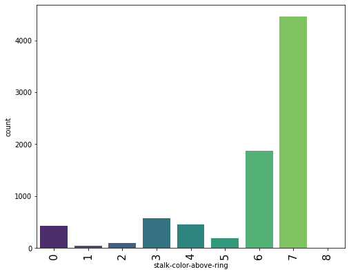
    


    c:\users\sadaruwan\appdata\local\programs\python\python39\lib\site-packages\seaborn\_decorators.py:36: FutureWarning: Pass the following variable as a keyword arg: x. From version 0.12, the only valid positional argument will be `data`, and passing other arguments without an explicit keyword will result in an error or misinterpretation.
      warnings.warn(
    


    
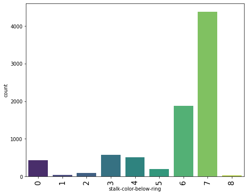
    


    c:\users\sadaruwan\appdata\local\programs\python\python39\lib\site-packages\seaborn\_decorators.py:36: FutureWarning: Pass the following variable as a keyword arg: x. From version 0.12, the only valid positional argument will be `data`, and passing other arguments without an explicit keyword will result in an error or misinterpretation.
      warnings.warn(
    


    
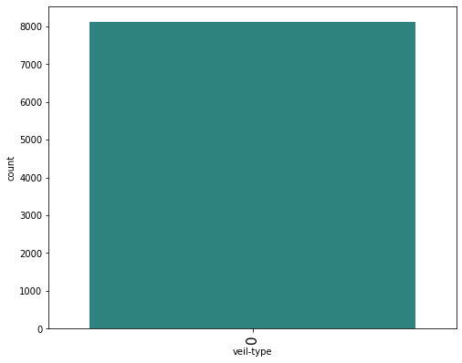
    


    c:\users\sadaruwan\appdata\local\programs\python\python39\lib\site-packages\seaborn\_decorators.py:36: FutureWarning: Pass the following variable as a keyword arg: x. From version 0.12, the only valid positional argument will be `data`, and passing other arguments without an explicit keyword will result in an error or misinterpretation.
      warnings.warn(
    


    
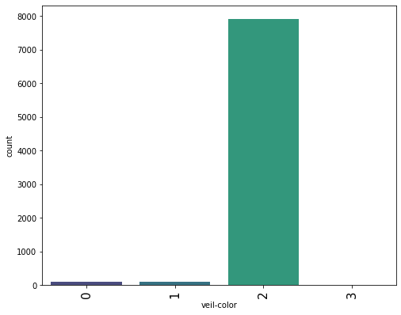
    


    c:\users\sadaruwan\appdata\local\programs\python\python39\lib\site-packages\seaborn\_decorators.py:36: FutureWarning: Pass the following variable as a keyword arg: x. From version 0.12, the only valid positional argument will be `data`, and passing other arguments without an explicit keyword will result in an error or misinterpretation.
      warnings.warn(
    


    
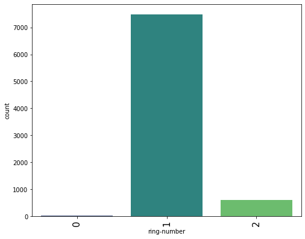
    


    c:\users\sadaruwan\appdata\local\programs\python\python39\lib\site-packages\seaborn\_decorators.py:36: FutureWarning: Pass the following variable as a keyword arg: x. From version 0.12, the only valid positional argument will be `data`, and passing other arguments without an explicit keyword will result in an error or misinterpretation.
      warnings.warn(
    


    
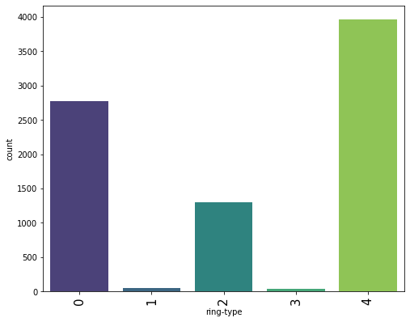
    


    c:\users\sadaruwan\appdata\local\programs\python\python39\lib\site-packages\seaborn\_decorators.py:36: FutureWarning: Pass the following variable as a keyword arg: x. From version 0.12, the only valid positional argument will be `data`, and passing other arguments without an explicit keyword will result in an error or misinterpretation.
      warnings.warn(
    


    
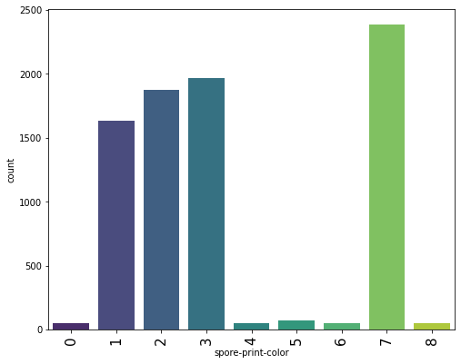
    


    c:\users\sadaruwan\appdata\local\programs\python\python39\lib\site-packages\seaborn\_decorators.py:36: FutureWarning: Pass the following variable as a keyword arg: x. From version 0.12, the only valid positional argument will be `data`, and passing other arguments without an explicit keyword will result in an error or misinterpretation.
      warnings.warn(
    


    
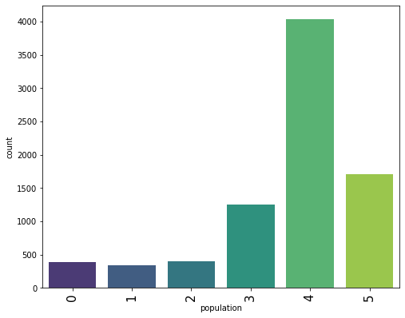
    


    c:\users\sadaruwan\appdata\local\programs\python\python39\lib\site-packages\seaborn\_decorators.py:36: FutureWarning: Pass the following variable as a keyword arg: x. From version 0.12, the only valid positional argument will be `data`, and passing other arguments without an explicit keyword will result in an error or misinterpretation.
      warnings.warn(
    


    
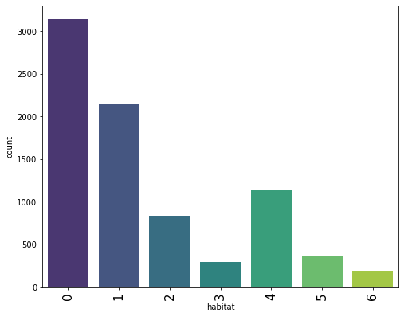
    


## PRE PROCCESSING


```python
label = LabelEncoder()
df = df.apply(label.fit_transform)
df.head()
```


<div>
<style scoped>
    .dataframe tbody tr th:only-of-type {
        vertical-align: middle;
    }

    .dataframe tbody tr th {
        vertical-align: top;
    }

    .dataframe thead th {
        text-align: right;
    }
</style>
<table border="1" class="dataframe">
  <thead>
    <tr style="text-align: right;">
      <th></th>
      <th>class</th>
      <th>cap-shape</th>
      <th>cap-surface</th>
      <th>cap-color</th>
      <th>bruises</th>
      <th>odor</th>
      <th>gill-attachment</th>
      <th>gill-spacing</th>
      <th>gill-size</th>
      <th>gill-color</th>
      <th>...</th>
      <th>stalk-surface-below-ring</th>
      <th>stalk-color-above-ring</th>
      <th>stalk-color-below-ring</th>
      <th>veil-type</th>
      <th>veil-color</th>
      <th>ring-number</th>
      <th>ring-type</th>
      <th>spore-print-color</th>
      <th>population</th>
      <th>habitat</th>
    </tr>
  </thead>
  <tbody>
    <tr>
      <th>0</th>
      <td>1</td>
      <td>5</td>
      <td>2</td>
      <td>4</td>
      <td>1</td>
      <td>6</td>
      <td>1</td>
      <td>0</td>
      <td>1</td>
      <td>4</td>
      <td>...</td>
      <td>2</td>
      <td>7</td>
      <td>7</td>
      <td>0</td>
      <td>2</td>
      <td>1</td>
      <td>4</td>
      <td>2</td>
      <td>3</td>
      <td>5</td>
    </tr>
    <tr>
      <th>1</th>
      <td>0</td>
      <td>5</td>
      <td>2</td>
      <td>9</td>
      <td>1</td>
      <td>0</td>
      <td>1</td>
      <td>0</td>
      <td>0</td>
      <td>4</td>
      <td>...</td>
      <td>2</td>
      <td>7</td>
      <td>7</td>
      <td>0</td>
      <td>2</td>
      <td>1</td>
      <td>4</td>
      <td>3</td>
      <td>2</td>
      <td>1</td>
    </tr>
    <tr>
      <th>2</th>
      <td>0</td>
      <td>0</td>
      <td>2</td>
      <td>8</td>
      <td>1</td>
      <td>3</td>
      <td>1</td>
      <td>0</td>
      <td>0</td>
      <td>5</td>
      <td>...</td>
      <td>2</td>
      <td>7</td>
      <td>7</td>
      <td>0</td>
      <td>2</td>
      <td>1</td>
      <td>4</td>
      <td>3</td>
      <td>2</td>
      <td>3</td>
    </tr>
    <tr>
      <th>3</th>
      <td>1</td>
      <td>5</td>
      <td>3</td>
      <td>8</td>
      <td>1</td>
      <td>6</td>
      <td>1</td>
      <td>0</td>
      <td>1</td>
      <td>5</td>
      <td>...</td>
      <td>2</td>
      <td>7</td>
      <td>7</td>
      <td>0</td>
      <td>2</td>
      <td>1</td>
      <td>4</td>
      <td>2</td>
      <td>3</td>
      <td>5</td>
    </tr>
    <tr>
      <th>4</th>
      <td>0</td>
      <td>5</td>
      <td>2</td>
      <td>3</td>
      <td>0</td>
      <td>5</td>
      <td>1</td>
      <td>1</td>
      <td>0</td>
      <td>4</td>
      <td>...</td>
      <td>2</td>
      <td>7</td>
      <td>7</td>
      <td>0</td>
      <td>2</td>
      <td>1</td>
      <td>0</td>
      <td>3</td>
      <td>0</td>
      <td>1</td>
    </tr>
  </tbody>
</table>
<p>5 rows × 23 columns</p>
</div>


```python
x = df.drop(['class'],axis = 1)
y = df['class']
```


```python
x_train, x_test, y_train, y_test = train_test_split(x,y, test_size=0.2, random_state=0)
```

## MODELS BULDING

### DecisionTreeClassifier

#### random_state = 0 & max_depth = 4


```python
model_1 = DecisionTreeClassifier(random_state=0, max_depth=4)
```


```python
model_1.fit(x_train,y_train)
```


    DecisionTreeClassifier(max_depth=4, random_state=0)


```python
pred_1 = model_1.predict(x_test)
```


```python
acc_per = accuracy_score(y_test,pred_1)
```


```python
df_predict_1 = pd.DataFrame({'Actual': y_test, 'Predicted': pred_1})
```


```python
df_predict_1.head(10)
```


<div>
<style scoped>
    .dataframe tbody tr th:only-of-type {
        vertical-align: middle;
    }

    .dataframe tbody tr th {
        vertical-align: top;
    }

    .dataframe thead th {
        text-align: right;
    }
</style>
<table border="1" class="dataframe">
  <thead>
    <tr style="text-align: right;">
      <th></th>
      <th>Actual</th>
      <th>Predicted</th>
    </tr>
  </thead>
  <tbody>
    <tr>
      <th>380</th>
      <td>1</td>
      <td>1</td>
    </tr>
    <tr>
      <th>3641</th>
      <td>0</td>
      <td>0</td>
    </tr>
    <tr>
      <th>273</th>
      <td>0</td>
      <td>0</td>
    </tr>
    <tr>
      <th>1029</th>
      <td>0</td>
      <td>0</td>
    </tr>
    <tr>
      <th>684</th>
      <td>0</td>
      <td>0</td>
    </tr>
    <tr>
      <th>2899</th>
      <td>0</td>
      <td>0</td>
    </tr>
    <tr>
      <th>1568</th>
      <td>1</td>
      <td>1</td>
    </tr>
    <tr>
      <th>6126</th>
      <td>1</td>
      <td>1</td>
    </tr>
    <tr>
      <th>2267</th>
      <td>0</td>
      <td>0</td>
    </tr>
    <tr>
      <th>4030</th>
      <td>1</td>
      <td>1</td>
    </tr>
  </tbody>
</table>
</div>


```python
print('Model Accuracy : '+ str(round(acc_per*100))+'%')
```

    Model Accuracy : 98%
    

## **ACCCURACY : 98%**


```python
confusion_matrix(y_test, pred_1)
```


    array([[830,  22],
           [  7, 766]], dtype=int64)


#### random_state=0,criterion='entropy',max_depth=None


```python
model_2 = DecisionTreeClassifier(random_state=0,criterion='entropy',max_depth=None)
```


```python
model_2.fit(x_train,y_train)
```


    DecisionTreeClassifier(criterion='entropy', random_state=0)


```python
pred_2 = model_2.predict(x_test)
```


```python
df_predict_2 = pd.DataFrame({'Actual': y_test, 'Predicted': pred_2})
```


```python
df_predict_2.head(10)
```


<div>
<style scoped>
    .dataframe tbody tr th:only-of-type {
        vertical-align: middle;
    }

    .dataframe tbody tr th {
        vertical-align: top;
    }

    .dataframe thead th {
        text-align: right;
    }
</style>
<table border="1" class="dataframe">
  <thead>
    <tr style="text-align: right;">
      <th></th>
      <th>Actual</th>
      <th>Predicted</th>
    </tr>
  </thead>
  <tbody>
    <tr>
      <th>380</th>
      <td>1</td>
      <td>1</td>
    </tr>
    <tr>
      <th>3641</th>
      <td>0</td>
      <td>0</td>
    </tr>
    <tr>
      <th>273</th>
      <td>0</td>
      <td>0</td>
    </tr>
    <tr>
      <th>1029</th>
      <td>0</td>
      <td>0</td>
    </tr>
    <tr>
      <th>684</th>
      <td>0</td>
      <td>0</td>
    </tr>
    <tr>
      <th>2899</th>
      <td>0</td>
      <td>0</td>
    </tr>
    <tr>
      <th>1568</th>
      <td>1</td>
      <td>1</td>
    </tr>
    <tr>
      <th>6126</th>
      <td>1</td>
      <td>1</td>
    </tr>
    <tr>
      <th>2267</th>
      <td>0</td>
      <td>0</td>
    </tr>
    <tr>
      <th>4030</th>
      <td>1</td>
      <td>1</td>
    </tr>
  </tbody>
</table>
</div>


```python
acc_per2 = accuracy_score(y_test,pred_2)
```


```python
print('Model Accuracy : '+ str(round(acc_per2*100))+'%')
```

    Model Accuracy : 100%
    

## **ACCCURACY : 100%**


```python
confusion_matrix(y_test, pred_2)
```


    array([[852,   0],
           [  0, 773]], dtype=int64)


```python

```
